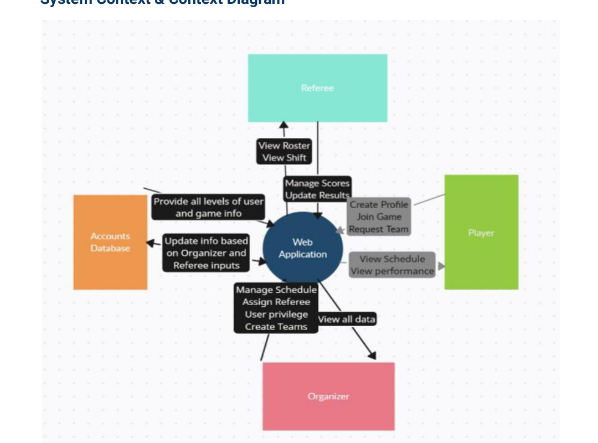
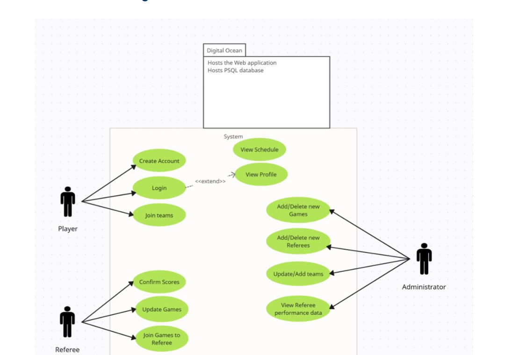
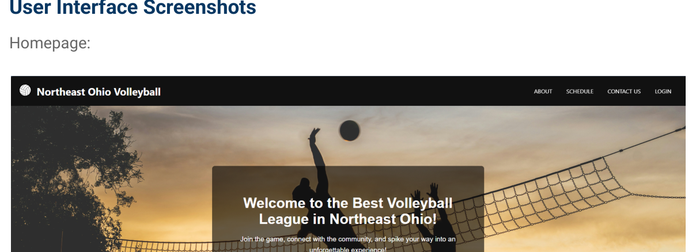
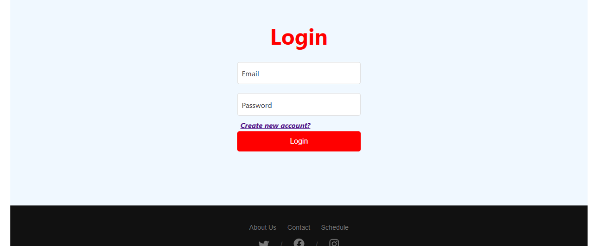
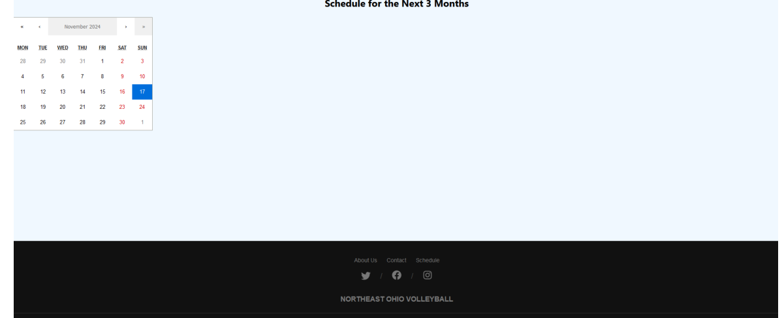
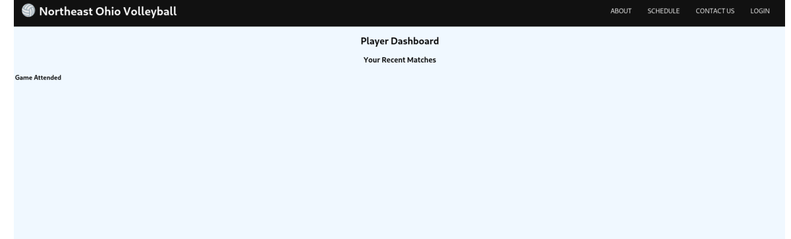

# League Stat-Us

League Stat-Us is a full-stack web application for recreational volleyball league management. It replaces paper-based scheduling, scorekeeping, and team records with a digital platform for players, referees, and league administrators.

The project was designed for the Northeast Ohio recreational volleyball community and focuses on practical league operations: user accounts, schedule visibility, referee workflows, score tracking, roster management, and analytics-ready data.

## Core Features

- Role-based user experience for players, referees, and administrators
- User authentication with custom user roles
- Schedule views for upcoming games
- Admin dashboard for league management workflows
- Referee dashboard for game and score management
- Player dashboard for schedule and team information
- Analytics module for attendance and match results
- Responsive React interface for desktop and mobile usage
- Django REST API backend with PostgreSQL support

## Tech Stack

| Layer | Technology |
| --- | --- |
| Frontend | React, React Router, Axios, React Calendar |
| Backend | Django, Django REST Framework |
| Authentication | Django auth, Simple JWT |
| Database | PostgreSQL |
| API Style | REST |
| Deployment Target | DigitalOcean / cloud VM |

## Repository Structure

```text
League-Stat-Us/
├── backend/                 # Django REST API and domain modules
│   ├── analytics/           # Attendance and match result data
│   ├── games/               # Game-related app scaffold
│   ├── notifications/       # Notification app scaffold
│   ├── scheduling/          # Teams, games, serializers, API views
│   ├── users/               # Custom user model, roles, auth APIs
│   ├── volleyball_platform/ # Django project settings and routes
│   ├── fixtures/            # Demo data
│   ├── manage.py
│   ├── requirements.txt
│   └── .env.example
├── frontend/                # React application
├── docs/                    # System design documentation and report assets
│   ├── SYSTEM_DESIGN.md
│   ├── ARCHITECTURE.md
│   ├── DATABASE_SCHEMA.md
│   ├── PRODUCT_REQUIREMENTS.md
│   ├── technical_report.pdf
│   └── assets/
└── README.md
```

## System Design

The system follows a layered architecture:

```text
Users → React Frontend → Django REST API → PostgreSQL Database → Cloud Hosting
```

The detailed design documentation is available in:

- [System Design](docs/SYSTEM_DESIGN.md)
- [Architecture](docs/ARCHITECTURE.md)
- [Database Schema](docs/DATABASE_SCHEMA.md)
- [Product Requirements](docs/PRODUCT_REQUIREMENTS.md)
- [Full Technical Report](docs/technical_report.pdf)

### Key Architecture Diagrams

#### System Context



#### Use Case Diagram



#### Database Schema


## Screenshots

| Home | Login |
| --- | --- |
|  |  |

| Schedule | Player Dashboard |
| --- | --- |
|  |  |

## Getting Started

### Backend Setup

```bash
cd backend
python -m venv .venv
source .venv/bin/activate      # Windows: .venv\Scripts\activate
pip install -r requirements.txt
cp .env.example .env
python manage.py migrate
python manage.py loaddata fixtures/demo_data.json
python manage.py runserver
```

The backend runs at `http://127.0.0.1:8000/` by default.

### Frontend Setup

Open a second terminal:

```bash
cd frontend
npm install
npm start
```

The frontend runs at `http://localhost:3000/` by default.

## API Areas

- `/api/users/` - registration, authentication, and user role workflows
- `/api/scheduling/` - teams, games, and scheduling data
- `/api/analytics/` - attendance and match result reporting

Exact routes are defined in each Django app's `urls.py` file.

## Design Goals

- Replace manual record keeping with a centralized digital system
- Support separate workflows for players, referees, and administrators
- Keep the user interface accessible on mobile devices during games
- Use a relational data model that can expand to tournaments and substitute-player workflows
- Keep frontend and backend separated through a REST API for maintainability

## Future Improvements

- Tournament scheduling and bracket support
- Substitute player finder / player connection hub
- Advanced team and referee analytics dashboard
- Notification system for schedule changes
- Production deployment configuration with HTTPS and automated backups
- Expanded automated test coverage

## Contributors

- Abishek Pandit
- Daniel Koirala
- Joseph Morell
- Jacob Dunay
