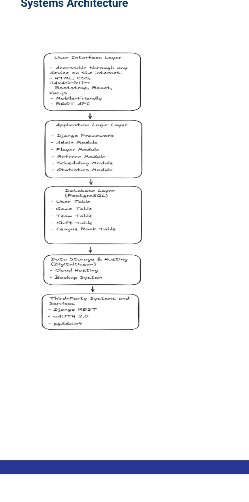

# Architecture

## Layered Architecture



League Stat-Us uses a layered web application architecture.

### 1. User Interface Layer

The React frontend provides the browser-based interface for players, referees, and administrators. It handles navigation, dashboards, forms, schedule display, and API calls.

### 2. Application Logic Layer

The Django backend handles request processing, authentication, permissions, validation, and domain workflows.

Primary backend modules:

- `users` - custom user model and role-based account behavior
- `scheduling` - teams, games, schedules, and referee assignment data
- `analytics` - attendance and match result models
- `games` - game app scaffold for future expansion
- `notifications` - notification app scaffold for future expansion

### 3. API Layer

Django REST Framework exposes structured JSON endpoints consumed by the React app. Simple JWT is included for token-based authentication.

### 4. Database Layer

PostgreSQL stores persistent application data including users, teams, games, referee assignments, scores, and ranking information.

### 5. Hosting Layer

The original design targets cloud hosting, such as DigitalOcean. A production environment should include HTTPS, environment-based secrets, database backups, and monitoring.

## Data Flow

```text
1. User interacts with React page
2. React sends request through Axios
3. Django REST Framework validates request
4. Django application logic reads/writes PostgreSQL data
5. API returns JSON response
6. React updates the UI
```

## Security Notes

Current security-oriented design elements:

- Role field on the custom user model
- Django authentication foundation
- JWT-ready API authentication
- Admin/referee/player workflow separation
- Environment-based configuration through `.env`

Recommended production improvements:

- Enforce object-level permissions on all sensitive endpoints
- Add password and rate-limit protections for authentication endpoints
- Use HTTPS-only cookies or hardened token storage strategy
- Move all secrets to environment variables
- Add audit logging for administrative actions
