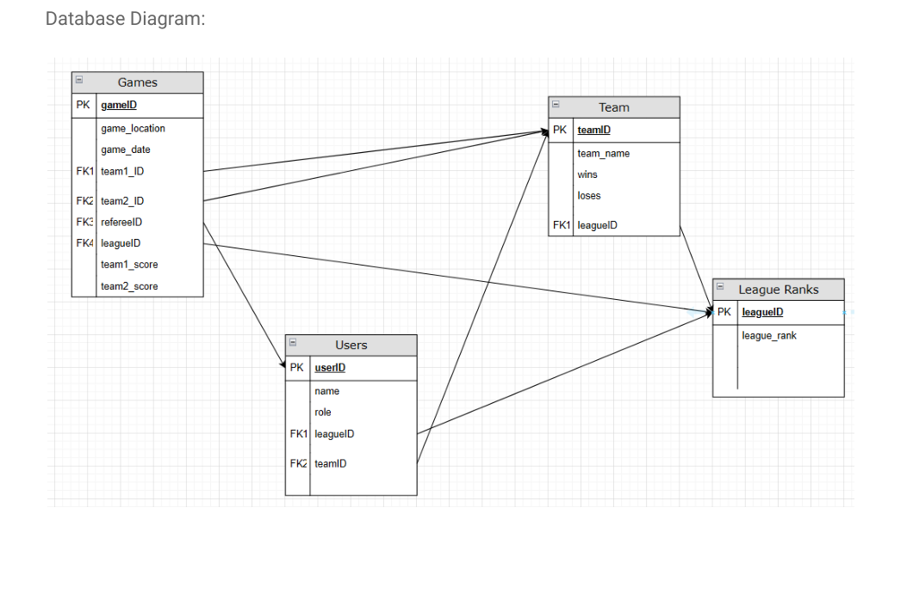

# Database Schema

## Original Schema Diagram

## Core Entities

### Users

Represents application accounts. Users are categorized by role:

- `player`
- `referee`
- `admin`

Important fields include username, email, password hash, role, bio, status, profile picture, and team relationships.

### Teams

Represents volleyball teams and their members.

### Games

Represents scheduled games, including date, time, location, teams, and assigned referee.

### Attendance

Tracks whether users attended specific games.

### Match Results

Stores game outcomes, including winning team, losing team, and draw status.

## Current Django Model Areas

| App | Responsibility |
| --- | --- |
| `users` | User roles, user profile data, teams |
| `scheduling` | Team and game scheduling data |
| `analytics` | Attendance and match result models |
| `games` | Game app scaffold |
| `notifications` | Notification app scaffold |

## Future Schema Improvements

- Consolidate duplicate team concepts between `users` and `scheduling`
- Add explicit referee shift model
- Add league/season model for multi-season history
- Add tournament and bracket models
- Add notification delivery status model
- Add audit table for admin actions
